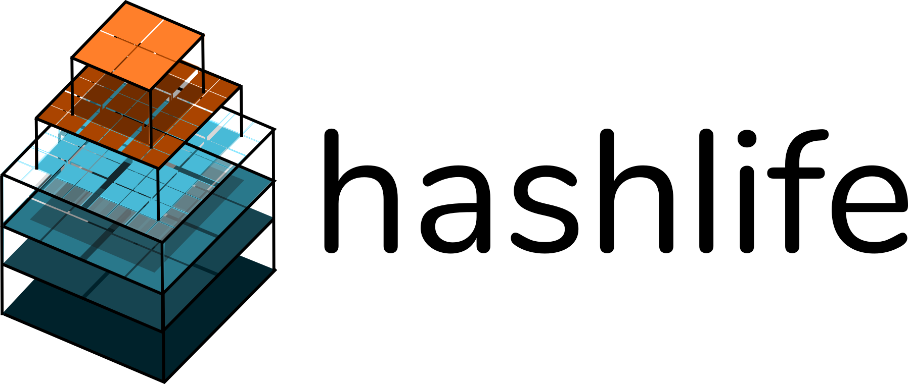
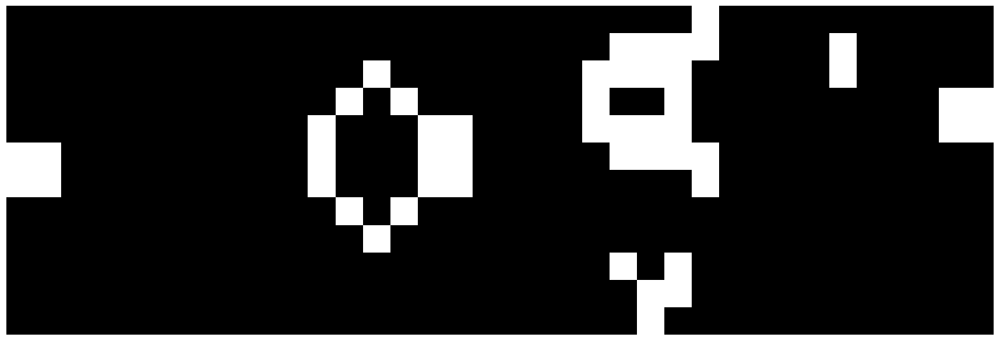

Implementation of Gosper's hashlife algorithm. See [johnhw.github.io/hashlife](johnhw.github.io/hashlife) for a full explanation.

Usage:

```python
from hashlife import construct, advance, node_30
from render import render_img

pat, _ = autoguess_life_file("lifep/gun30.lif")
node = construct(pat) # create quadtree
node_30 = advance(node, 30)
pts = expand(node_30)
render_img(pts)
```



Life patterns in `lifep/` collected by Alan Hensel.